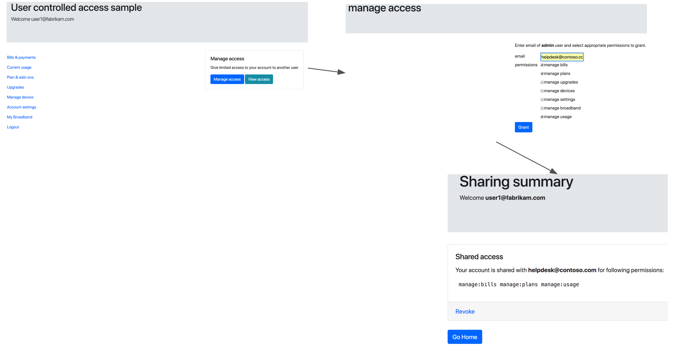
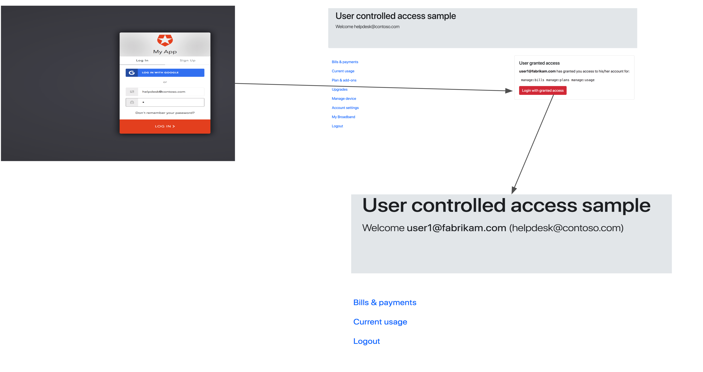

# User controlled access

 
This sample demonstrates a _pattern_ to implement "impersonation" kind of a solution but in a safer and user controlled manner. The sample enables sharing limited access of "my account" to an admin/Helpdesk user to troubleshoot account related issues.

*The sample assumes both primary user and the help desk user are assumed to be in the same Auth0 connection.*
  
## Run locally

```
git clone git@github.com:zamd/user-controlled-access-sample.git
```
```
cd user-controlled-access-sample
```
```
npm i
```


### Auth0 setup

#### Client setup

- Create a `Regular Web App` in Auth0 dashboard
- Set `Allowed Callback Urls`. The default setup uses `http://localhost:3000/login/callback`  
- Create and enable a database connection on this app
- Create two users in above database connection as:
	- helpdesk@contoso.com
	- user1@fabrikam.com
	
- Go to `Apis` --> `Auth0 Management API` and authorize `Regular Web App` client to  `read:users` `update:users` scopes
- Copy `client_id` `client_secet` to .env file. 
- Sample `.env` file:
```
Domain=test-access.auth0.com
ClientID=232323232
ClientSecret=32-4_YTz6Y1uT
CallbackURL=http://loopback.com:3000/login/callback
```
#### Rule setup
- Create `user-controlled-access` rule with following sample code:
```javascript
function (user, context, callback) {

var  _  =require('lodash@4.8.2');

var  requestedScopes  =  context.request.query  &&  context.request.query.scope.split(' ') || [];

var  targetScope  =  requestedScopes.find(s=>s.indexOf('user_controlled_access')!==-1);

if (targetScope) {

//TODO: validate/verify authorized_access depending on application's domain.

var  onwerId  =  targetScope.split('/')[1];

var  ag  =  user.app_metadata.access_grants.find(ag=>ag.owner_id===onwerId);

context.idToken["http://user.controlled.access/authorized_access"] =  ag;

}

callback(null, user, context);

}
```

#### Run

```
npm start
```

-  Browser to `http://localhost:3000` and login with `user1@fabrikam.com` user. 
 - Select `Manage access` and give `helpdesk@contoso.com` restricted access 



 - Now, logout and login in as `helpdesk@contoso.com` and you can switch to restricted access view.
 
